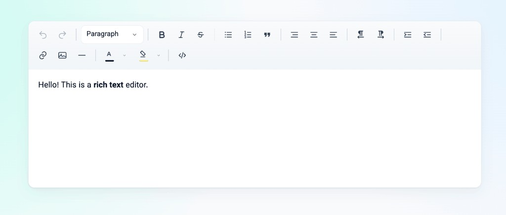

# TeemEditor

**Simple. Efficient. Fast.** A lightweight WYSIWYG editor for **React** and **Next.js**, with first-class **RTL** support for Persian and Arabic, plus English and other **LTR** languages.



## Why TeemEditor

- **Simple** — one component, clear API, no heavy schema or plugin maze
- **Efficient** — small surface area, focused features, easy to drop into any app
- **Performant** — lean client-side editor built for real product UIs
- **React & Next.js ready** — works in client components; easy dynamic import for App Router
- **RTL / LTR** — full bidirectional UI and content direction (`fa`, `ar`, `en`, and more)

## Features

- Headings (`h1`–`h6`), paragraphs, blockquote, and preformatted text
- Bullet and numbered lists
- Bold, italic, strikethrough
- Left / center / right alignment (text and images)
- Indent / outdent (without accidental blockquotes)
- Link insert with hover popover to edit or remove
- Image insert (secure upload or URL), resize, alt-text editing, and alignment
- Horizontal rule
- Text color, highlight, and custom color picker
- Undo / redo
- **HTML source mode** — CodeMirror editor with syntax highlighting
- **Markdown import** — paste Markdown and convert to sanitized HTML
- **Fullscreen** editing (press `Esc` to exit)
- Toolbar **RTL / LTR** toggles for inline text direction
- i18n UI: `en` (default), `fa`, `ar`

## Install

```bash
npm install teem-editor
```

`react` and `react-dom` must already be in your project. DOMPurify, CodeMirror, and Marked are bundled as dependencies — no extra install step.

Optional font for Persian/Arabic UI: [Vazirmatn](https://fonts.google.com/specimen/Vazirmatn)

```html
<link href="https://fonts.googleapis.com/css2?family=Vazirmatn:wght@400;600;700&display=swap" rel="stylesheet" />
```

## Usage (React)

```jsx
import { useState } from 'react';
import { TeemEditor } from 'teem-editor';
import 'teem-editor/styles.css';

export default function MyPage() {
  const [html, setHtml] = useState('<p><br></p>');

  return (
    <TeemEditor
      value={html}
      onChange={setHtml}
      language="en"
      onUpload={async (file) => {
        const form = new FormData();
        form.append('file', file);
        const res = await fetch('/api/upload', { method: 'POST', body: form });
        const data = await res.json();
        return data.url;
      }}
    />
  );
}
```

### Persian / Arabic (RTL)

```jsx
<TeemEditor language="fa" value={html} onChange={setHtml} />
<TeemEditor language="ar" value={html} onChange={setHtml} />
```

`dir` defaults to `ltr` for English and `rtl` for `fa` / `ar`. Override anytime with the `dir` prop.

### HTML source & Markdown

Use the toolbar to switch between visual editing and raw HTML, or paste Markdown and insert converted HTML:

- **Edit HTML** — toggle source mode (CodeMirror with HTML highlighting). Changes are sanitized on save.
- **Markdown** — open the dialog, paste Markdown (GFM), click **Convert & insert**.
- **Fullscreen** — expand the editor; press `Esc` to exit.

## Next.js (App Router)

Client Component:

```jsx
'use client';

import { useState } from 'react';
import { TeemEditor } from 'teem-editor';
import 'teem-editor/styles.css';

export default function RichEditor() {
  const [html, setHtml] = useState('<p>Hello world</p>');
  return (
    <TeemEditor
      language="en"
      value={html}
      onChange={setHtml}
      onUpload={uploadToServer}
    />
  );
}
```

Or load from a Server Component:

```jsx
import dynamic from 'next/dynamic';

const TeemEditor = dynamic(
  () => import('teem-editor').then((m) => m.TeemEditor),
  { ssr: false }
);
```

## Image upload security

Before upload, TeemEditor checks:

1. Allowed extensions: `.jpg` `.jpeg` `.png` `.gif` `.webp`
2. Allowed MIME types
3. Real **magic bytes** (anti-spoof)
4. Max size (default 2 MB)
5. Filename sanitization
6. HTML sanitization with DOMPurify (strips `script`, event handlers, `javascript:` URLs)

### Production tip

Prefer `onUpload` and re-validate on your server. Without `onUpload`, images are embedded as **base64 data URLs** (works offline, larger HTML).

```js
uploadOptions={{
  maxSizeBytes: 2 * 1024 * 1024,
  allowedMimeTypes: ['image/jpeg', 'image/png', 'image/webp', 'image/gif'],
}}
```

## Props

| Prop | Type | Description |
|------|------|-------------|
| `value` | `string` | Controlled HTML |
| `defaultValue` | `string` | Initial HTML (uncontrolled) |
| `onChange` | `(html) => void` | Sanitized HTML callback |
| `language` | `'en' \| 'fa' \| 'ar'` | UI language (default: `en`) |
| `placeholder` | `string` | Placeholder text |
| `dir` | `'rtl' \| 'ltr'` | Content direction (defaults from language) |
| `minHeight` | `number` | Minimum editor height |
| `noscroll` | `boolean` | Grow with content (default `false` → max height = viewport, scroll inside) |
| `disabled` | `boolean` | Disable editing |
| `onUpload` | `(file, meta) => Promise<string>` | Image upload → URL |
| `uploadOptions` | `object` | Upload validation options |
| `toolbar` | `boolean` | Show toolbar |
| `className` / `style` | — | Root container styling |

## Ref API

```jsx
const ref = useRef(null);

ref.current.focus();
ref.current.getHTML();
ref.current.setHTML('<p>Hello</p>');
ref.current.clear();
ref.current.getEditorElement(); // contenteditable root (visual mode)
```

## Helpers

```js
import {
  sanitizeHtml,
  validateImageFile,
  processImageUpload,
  uploadDefaults,
  createHistory,
  getMessages,
  getDefaultDir,
  resolveLanguage,
  getBlockOptions,
  locales,
  isSafeHref,
  isSafeImageSrc,
} from 'teem-editor';
```

## Local development

```bash
npm install
npm run dev    # Vite demo
npm run build  # Build dist for npm
```

## License

MIT
